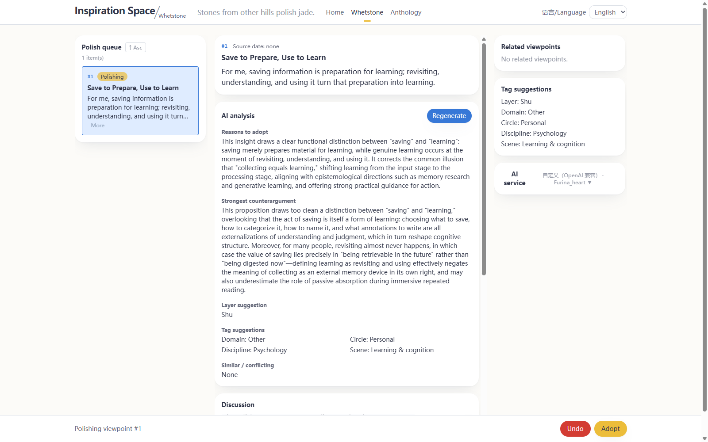
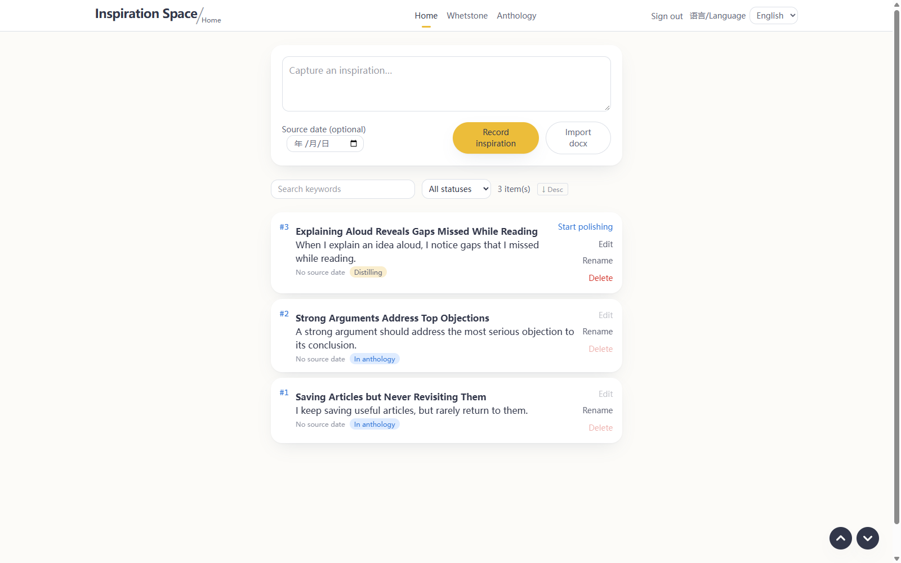
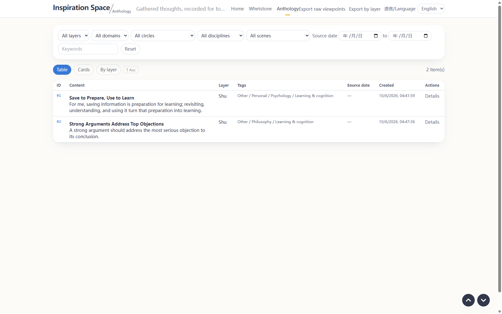

# InspirationSpace · 灵感空间

**Turn passing thoughts into considered views.**

InspirationSpace is an open-source Windows desktop workspace for thinking through ideas in Chinese and English. Capture an observation, distill it into a claim, and polish it with AI-generated reasons and counterarguments. You review the wording and decide what enters your collection of accepted views. AI helps you examine an idea; user confirmation controls acceptance.

Built with React, FastAPI, SQLite, and pywebview. Records are stored locally; AI features send relevant context to the provider you configure. Structured AI suggestions pass schema and business validation, and confirmed adoption updates run in a database transaction.



| Capture inspirations | Revisit accepted views |
|---|---|
|  |  |

[More real application screenshots](docs/hackathon/shots/README.md) · [Project description](docs/hackathon/submission-en.md) · [Windows releases](https://github.com/Bob-Heng/inspiration-space/releases)

## 项目介绍

灵感空间以“观点”为中心，帮助你整理个人知识、保留判断依据并重新审视自己的理解。

> 灵感录入 → 提炼为观点 → AI 分析与讨论打磨 → 用户确认采纳 → 集思录 → 回顾或撤回继续讨论

录入灵感时创建关联的草稿观点；草稿在他山坊中提炼和打磨，采纳后进入集思录。原始灵感保留，工作稿可以调整。AI 提供分析、提问、翻译和标题；正式采纳由用户确认，后端负责校验与落库。

## 功能特性

- **灵感录入与文档导入**：直接输入，或从 Word 文档拆分条目；导入预览可勾选、编辑正文与日期后确认。
- **提炼与打磨两阶段**：用对话把现象、素材、疑问收敛为观点，再生成分析、讨论和修订；已构成观点的条目可由用户确认直接进入打磨。
- **他山坊**：队列、当前观点与分析讨论、关联观点建议组成三栏工作台，各栏独立滚动；分析与讨论持久化，可继续未完成的会话。
- **AI 分析**：同时提供采纳理由与最强反对理由，提出道／法／术分层、领域／圈层／学科／场景标签，以及相近或冲突关系建议。
- **用户确认采纳**：检查最终正文、双语标题、分类、标签和所选关系，再提交采纳。关系建议由用户选择；冲突关系不自动裁决观点。
- **集思录**：浏览已采纳观点，支持表格、卡片、分类视图与多维筛选。已采纳观点可撤回他山坊继续讨论。
- **原生中英双语**：界面语言切换，AI 辅助正文翻译与双语标题。内容翻译需要可用的模型服务。
- **Word 导出**：导出原始观点或按分层组织的观点。
- **AI 服务可配置**：支持 OpenAI、DeepSeek、Kimi、智谱及自定义 OpenAI 兼容接口，可接入本地网关。
- **可追溯**：来源灵感、工作稿、保留的分析讨论、采纳决策与 AI 调用记录支持反查。用户撤销、重置、撤回或删除时会移除相应记录。

## 安装（Windows）

1. 在 [Releases](https://github.com/Bob-Heng/inspiration-space/releases) 下载 `InspirationSpace-Setup-x.x.x.exe`。
2. 双击安装。安装包未签名，Windows 可能显示 SmartScreen 提示。
3. 打开“灵感空间”，首次使用时创建本地账号。

系统要求：Windows 10/11 与 WebView2 运行时。

应用记录保存在 `%LOCALAPPDATA%\InspirationSpace\data`，卸载不会删除这些记录。

## 使用要点

- **配置 AI**：在他山坊右栏“AI 服务设置”中选择服务商，填写 API Key 与需要覆盖的 Base URL，测试连接后选择模型。自定义接口可使用本地 OpenAI 兼容网关。
- **确认阶段与采纳**：进入打磨时检查可编辑的观点草稿；采纳时检查最终正文、标题与相关信息。
- **撤销与撤回**：撤销当前阶段的讨论轮次；长按撤销可在确认后回退阶段。集思录中的已采纳观点可以撤回继续打磨。
- **账号**：妥善保管本地账号密码。初始化时可选择填写手机号或生日，用于本地密码找回。

## 从源码运行

需要 Python 3.13+、满足前端依赖要求的 Node.js 和 npm。

```powershell
# 后端
cd backend
python -m venv venv
.\venv\Scripts\pip install -r requirements.txt
.\venv\Scripts\uvicorn app.main:app --reload --port 8000
```

```powershell
# 前端，另开终端
cd frontend
npm install
npm run dev
# http://localhost:5173
```

桌面模式需先构建前端产物，然后使用内嵌后端与 WebView2 窗口：

```powershell
cd frontend
npm run build
cd ..
.\backend\venv\Scripts\pythonw backend\desktop.py
```

后端测试：在 `backend` 目录运行 `.\venv\Scripts\python -m pytest`。

打包：使用 PyInstaller 构建桌面应用，再按 `installer/setup.iss` 使用 Inno Setup 编译安装包。

## 技术栈

| 层 | 选型 |
|---|---|
| 后端 | Python · FastAPI · SQLAlchemy · SQLite |
| 前端 | React · Vite · Tailwind CSS |
| 桌面外壳 | pywebview · Windows WebView2 |
| AI 接入 | OpenAI 兼容接口 · Pydantic Schema 与业务校验 |
| 采纳与追溯 | 数据库事务 · AI 调用记录 · 采纳决策记录 |
| 分发 | PyInstaller · Inno Setup |

## 数据与隐私

灵感、观点、讨论、账号和 AI 配置保存在本机数据库。使用 AI 功能时，应用会将完成该调用所需的正文、讨论或相关观点上下文发送给配置的 AI 服务商；该服务商如何处理请求，取决于其服务与配置。也可配置本地 OpenAI 兼容模型服务。

## License

[MIT](LICENSE)
